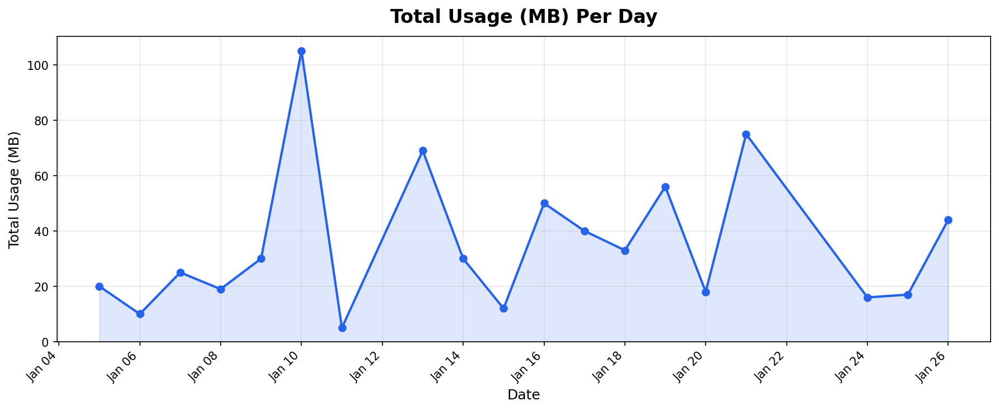

# Data Engineering Take-Home — Answers & Documentation

# Install dependencies
pip install pandas pyarrow matplotlib

# Run the analysis
python analysis.py

## Chart: Total Usage (MB) Per Day

## Answers

### Q1: Which `sim_card_id` had the highest total usage?

**SIM card (asset_id) 1001 — 155.0 MB**

To determine this, I joined `usage_events` → `profile_installation` → `sim_card_plan_history` using the profile's active date range to match each usage event to the SIM card (asset_id) that was installed at the time of the event.

| asset_id | Total MB |
|----------|----------|
| 1001     | 155.0    |
| 1003     | 129.0    |
| 1000     | 100.0    |
| 1002     | 94.0     |
| 1007     | 77.0     |
| 1005     | 57.0     |
| 1008     | 30.0     |
| 1006     | 5.0      |

### Q2: How many usage events resolved to 3G after cleanup?

**1 event**

After normalizing the `tech` field, only CDMA and HSPA+ map to 3G. The HSPA+ record (sid=30) was removed due to a far-future date (2035), and the CDMA record (sid=28) survived cleanup. So 1 event resolved to 3G.

Technology normalization mapping used:
- **4G:** LTE, lte, 4g, 4G
- **5G:** 5G, 5g, NR
- **3G:** CDMA, HSPA+
- **2G:** GSM

### Q3: How many duplicate usage events did you identify?

**2 duplicates**

`sid=2` appeared 3 times across three source files (`usage_1.parquet`, `usage_2.parquet`, `usage_3.parquet`). Two rows were exact duplicates (same sid, pid, evt_dttm, mb=50). A third had mb=55 — a conflicting value from a different source file. Since they share the same surrogate ID (`sid=2`), I treated them as the same event and kept the first occurrence (earliest `ld_dttm`).

### Q4: What is the cost of all data used?

**$9.90 USD** (across 17 events that could be fully costed)

8 events could not be costed due to:
- Orphan pid with no profile (pid=999)
- Missing bundle assignment at event time (e.g., event occurred outside the SIM plan's effective window)
- No matching rate for the technology/country-code combo (e.g., 3G and 2G rates didn't exist for bundle 2000)
- Suspicious/invalid cc2 values (999, 99999) with no matching rate card entry

## Data Quality Problems & Resolutions

| 1 | **Duplicate usage events** | usage_events | sid=2 loaded from 3 source files with different `ld_dttm` values. Two have mb=50, one has mb=55. | Kept first occurrence per sid (earliest load time). |
| 2 | **Negative MB** | usage_events | sid=26 has mb=-5.0 | Removed — usage cannot be negative. |
| 3 | **Null event timestamp** | usage_events | sid=27 has null `evt_dttm` | Removed — can't attribute to a day or match to a plan. |
| 4 | **Far-future date** | usage_events | sid=30 has evt_dttm=2035-01-01, but ld_dttm is 2026-01-09 | Removed — clearly a data entry error. |
| 5 | **Null tech** | usage_events | sid=23 has null `tech` | Kept — used the catch-all/default rate (prio=10) for costing. |
| 6 | **Null cc1** | usage_events | sid=28 has null `cc1` | Kept in usage totals — could not be costed without country code. |
| 7 | **Suspicious cc2** | usage_events | sid=18 (cc2=999), sid=29 (cc2=99999) | Kept — flagged as likely placeholder values; no matching rate exists. |
| 8 | **Orphan pid** | usage_events | pid=999 has no entry in profile_installation | Kept in usage totals — could not be joined for costing. |
| 9 | **Inconsistent tech casing** | usage_events | Mix of LTE/lte, 4G/4g, 5G/5g, plus NR | Normalized to standard generations (4G, 5G, 3G, 2G). |
| 10 | **Duplicate profile** | profile_installation | pid=103, asset_id=1005 appears twice with same dates but different `crt_dttm` | Deduplicated on pid + asset_id + beg_dttm + end_dttm. |
| 11 | **End before begin** | profile_installation | pid=107 has end_dttm (Jan 9) before beg_dttm (Jan 10) | Nullified end_dttm — treated as still-active profile. |
| 12 | **Overlapping profiles** | profile_installation | pid=102 has overlapping date ranges for asset_id 1003 and 1004 | Used first matching active profile during join. |
| 13 | **Expiry before effective** | sim_card_plan_history | asset_id=1007, bundle_id=2003 has x_dttm (Jan 14) before eff_dttm (Jan 15) | Removed this row — invalid date range. |
| 14 | **Duplicate plan entry** | sim_card_plan_history | asset_id=1002, bundle_id=2000 appears twice (why_cd: "activation" and "ACT") | Deduplicated on asset_id + bundle_id + eff_dttm. |
| 15 | **Negative rate** | rate_card | bundle_id=2000, 4G rate of -0.01 | Removed — rates should not be negative. |
| 16 | **Orphan bundle** | rate_card | bundle_id=9999 has no match in sim_card_plan_history | Removed from rate lookup. |
| 17 | **Typo in currency** | rate_card | curr_cd="US D" instead of "USD" | Cleaned by stripping spaces. |
| 18 | **Duplicate rates** | rate_card | bundle_id=2000/310/260/4G has two valid rates (0.010 and 0.011) after removing negative | Kept the later entry (0.011) assuming it's a correction. |

## Questions I Would Ask About the Data

1. **What does `sid` represent?** Is it a surrogate key for the usage event, or does it identify the SIM card itself? I assumed it's an event ID since the ERD labels it alongside `pid`.

2. **Are overlapping profiles for the same `pid` intentional?** pid=102 has two SIM cards (1003 and 1004) with overlapping date ranges. Is this a multi-SIM scenario or a data error?

3. **What are cc2 values 999 and 99999?** Are these placeholder codes for "unknown network" or legitimate MCC/MNC codes? They don't match any rate card entries, which suggests they're invalid.

## Assumptions

1. **`sid` is a unique event identifier.** When the same sid appears across multiple source files, it's the same event loaded multiple times — not separate events. I kept the first occurrence.

2. **`asset_id` = SIM card identifier.** The question asks about `sim_card_id`, which maps to `asset_id` in the schema since that's the field that identifies a physical SIM card in `profile_installation` and `sim_card_plan_history`.

3. **Technology normalization:** LTE = 4G, NR = 5G, CDMA = 3G, HSPA+ = 3G, GSM = 2G. These are standard telecom generation mappings.

4. **Rate card priority:** Higher `prio_nbr` = higher priority. A tech-specific rate (prio=100) takes precedence over a catch-all rate with `tech_cd=NULL` (prio=10).

5. **Rate card date filtering:** A rate is active when `beg_dttm <= evt_dttm` and either `end_dttm` is null or `end_dttm > evt_dttm`.

6. **Negative MB and rates are errors, not adjustments.** I removed them rather than treating them as credits/reversals, since there's no documentation suggesting an adjustment workflow.

7. **When conflicting rate card rows exist**, the later entry is the corrected value (e.g., 0.011 overrides 0.010 for bundle 2000/4G).
